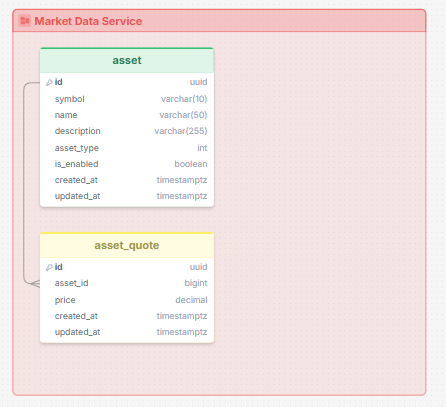

# Market Data Service

Este é um dos serviços que compõem a aplicação "WalletProfile", a proposta é capturar dados de mercado utilizando uma API externa e salvar na base de dados do projeto para disponibilizar para os outros serviços que compõem o `WalletProfile`.

## Propósito do projeto

Este projeto tem como objetivo exercitar algumas práticas relacionadas ao desenvolvimento de aplicações ASP.NET, desde a modelagem do domínio à implementação utilizando padrões conhecidos no mercado.

🔹 Responsável por:

- Recuperar e salvar dados de mercado
- Disponibilizar os dados via API
- Sincronizar cotações dos ativos habilitados periodicamente em background

🔹 Como funciona:

O cliente solicita as informações de investimento. Caso esteja disponível na base de dados, fornece diretamente. Caso contrário, a aplicação busca em um serviço externo, salva internamente e disponibiliza.

---

## API — Rotas disponíveis

Base path: `/api/assets`

### `GET /api/assets`

Retorna todos os ativos habilitados (`IsEnabled = true`) com suas cotações.

**Resposta `200 OK`:**
```json
[
  {
    "id": "uuid",
    "symbol": "PETR4",
    "name": "Petrobras",
    "description": "...",
    "assetType": "Stock",
    "rating": 8,
    "isEnabled": true,
    "createdAt": "2024-01-01T00:00:00Z",
    "updatedAt": "2024-01-01T00:00:00Z",
    "quotes": [
      {
        "price": 38.75,
        "updatedAt": "2024-01-01T00:00:00Z"
      }
    ]
  }
]
```

---

### `GET /api/assets/{symbol}`

Retorna os detalhes de um ativo pelo símbolo, incluindo suas cotações.

**Parâmetros:**
| Parâmetro | Tipo   | Local | Descrição             |
|-----------|--------|-------|-----------------------|
| `symbol`  | string | path  | Símbolo do ativo (ex: `PETR4`) |

**Respostas:**
- `200 OK` — ativo encontrado (mesmo schema acima)
- `404 Not Found` — ativo não encontrado

---

### `POST /api/assets`

Cria um novo ativo.

**Body (`application/json`):**
```json
{
  "symbol": "PETR4",
  "name": "Petrobras",
  "description": "Empresa de energia",
  "assetType": 0
}
```

| Campo        | Tipo     | Descrição                                      |
|--------------|----------|------------------------------------------------|
| `symbol`     | string   | Símbolo do ativo                               |
| `name`       | string   | Nome do ativo                                  |
| `description`| string   | Descrição do ativo                             |
| `assetType`  | int/enum | Tipo do ativo (ver tabela abaixo)              |

**Tipos de ativo (`AssetType`):**
| Valor | Nome    |
|-------|---------|
| 0     | Stock   |
| 1     | Bond    |
| 2     | Reit    |
| 3     | Etf     |
| 4     | Bdr     |

**Respostas:**
- `201 Created` — retorna o ativo criado com o header `Location` apontando para `GET /api/assets/{symbol}`
- `400 Bad Request` — dados inválidos

---

### `PATCH /api/assets/rating`

Atribui uma classificação (rating) a um ativo e o habilita automaticamente (`IsEnabled = true`).

**Body (`application/json`):**
```json
{
  "assetId": "uuid",
  "rating": 8
}
```

| Campo     | Tipo | Descrição                                        |
|-----------|------|--------------------------------------------------|
| `assetId` | Guid | ID do ativo                                      |
| `rating`  | int  | Nota de 1 a 10 (0 e valores acima de 10 são inválidos) |

**Respostas:**
- `200 OK` — ativo atualizado
- `400 Bad Request` — dados inválidos

---

### `DELETE /api/assets`

Remove um ativo pelo símbolo.

**Body (`application/json`):**
```json
{
  "symbol": "PETR4"
}
```

**Respostas:**
- `204 No Content` — ativo removido com sucesso

---

## Worker — MarketDataSyncWorker

O serviço possui um `BackgroundService` responsável por sincronizar as cotações dos ativos habilitados periodicamente.

| Propriedade        | Valor                          |
|--------------------|-------------------------------|
| Tipo               | `BackgroundService` (.NET)    |
| Intervalo          | A cada **15 minutos**         |
| Escopo             | Cria um novo `IServiceScope` a cada ciclo |

**O que faz a cada ciclo:**

1. Cria um novo escopo de DI para evitar problemas com serviços `Scoped`
2. Resolve `IMarketDataSyncService`
3. Chama `SyncEnabledAssets()` — busca e atualiza as cotações de todos os ativos com `IsEnabled = true`
4. Registra no console o início e fim da sincronização com um ID único por ciclo
5. Em caso de erro, registra a exceção no console e aguarda o próximo ciclo sem interromper o serviço

---

## Banco de dados

